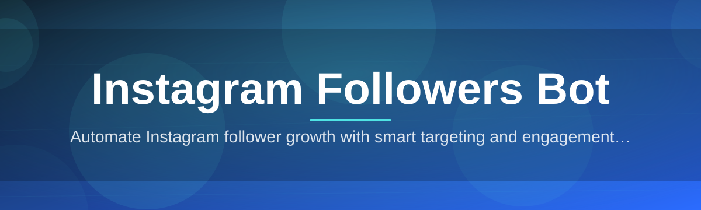
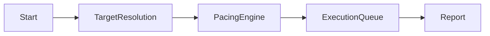

# instagram-followers-booster 🚀📈

  

*A community-built companion for growing your Instagram presence, one genuine interaction at a time.*

  

## 🌱 Overview

`instagram-followers-booster` is an open-source desktop companion built by a community of contributors who care about sustainable, transparent growth tools for Instagram. Instead of promising magic numbers overnight, this project focuses on automating the repetitive, tedious parts of audience building — engagement scheduling, targeted discovery, and activity pacing — so that creators, small businesses, and community managers can spend more time making content and less time clicking buttons.

The Instagram Followers Bot space is crowded with closed-source, black-box tools that ask for your credentials and give you nothing back in return. This repository exists as an alternative: fully inspectable code, a public roadmap, and a maintainer team that actually responds to issues. Whether you're a solo creator trying to understand how follower growth tooling works under the hood, or a developer looking for a well-scoped project to make your first open-source contribution, this project is designed to welcome you in.

We built this for people who are curious about automation, growth mechanics, and Windows desktop tooling — not just end users, but tinkerers. If you've ever wanted to peek behind the curtain of how an Instagram growth utility paces its actions, throttles requests, or organizes a queue of target accounts, the codebase here is written to be read, not just run.

> [!NOTE]
> This project is community-maintained. Releases, roadmap items, and design decisions are discussed openly in [Discussions](../../discussions) — everyone is welcome to weigh in.

---

## 🧩 What This Toolkit Actually Does

**Targeted audience discovery** — instead of blasting activity at random accounts, the bot lets you define niches, hashtags, and competitor audiences so growth stays relevant to your content.

**Human-paced action scheduling** — every follow, like, and comment action runs through a pacing engine that mimics natural usage rhythms rather than firing in mechanical bursts.

**Session-based activity queues** — build a queue of daily tasks, save it, pause it, resume it later. Nothing is lost if you close the app mid-session.

**Local-first credential handling** — your login session stays on your machine; nothing is proxied through a third-party server owned by us.

**Visual activity dashboard** — a live view of what the bot is doing right now, with a history log you can scroll back through.

**Customizable safety limits** — daily action caps, cooldown windows, and randomized delays that you control from the settings panel.

**Multi-account profiles** — switch between managed accounts without re-entering configuration every time.

**Exportable growth reports** — CSV/JSON exports of session activity so you can track what worked over time.

> [!TIP]
> New to the project? Check the `good-first-issue` label in our [Issues tab](../../issues) — we tag beginner-friendly tasks every week, from UI polish to documentation fixes.

---

## 🏁 How To Get Started

1. Visit the project landing page using the download button below.

2. Grab the latest Windows build — no installer wizard, just an executable.

3. Run the app, sign in to the account you want to manage, and set your pacing preferences.

4. Build your first action queue and let the dashboard show you what's happening in real time.

---

## 💻 System Requirements

| Requirement | Detail |
|---|---|
| OS | Windows 10 or Windows 11 (64-bit) |
| Dependencies | None — fully standalone executable |
| Disk Space | ~150 MB free |
| RAM | 4 GB minimum, 8 GB recommended |
| Network | Stable internet connection |

> [!IMPORTANT]
> This tool is Windows-only for now. Cross-platform support (macOS/Linux via a packaged runtime) is an open discussion item on our roadmap — contributions here are especially welcome.

---

## ⚙️ How It Works

The bot is built around a simple, transparent pipeline rather than a mysterious black box:

1. **Session Init** — the app opens a local, authenticated session tied to your Instagram login.

2. **Target Resolution** — your niche, hashtag, and account filters are resolved into a candidate list.

3. **Pacing Engine** — every candidate action is scheduled with human-like randomized delays and daily caps.

4. **Execution Queue** — actions run one at a time, logged live to the dashboard.

5. **Report Output** — a session summary is generated so you can review results and adjust strategy.

> [!WARNING]
> Aggressive pacing settings (very low cooldowns, very high daily caps) increase the risk of account restrictions from Instagram's own automation defenses. Sane defaults exist for a reason — tune carefully.

---

## 🛠️ Troubleshooting

<strong>The app won't launch after downloading.</strong>

Windows SmartScreen sometimes flags new executables from smaller open-source projects. Click "More info" → "Run anyway." If it still fails, check the Issues tab for your Windows build version.

<strong>My login keeps getting rejected.</strong>

Instagram occasionally requires a fresh in-app verification step for new sessions. Log in through the official Instagram app once, complete any prompted checkpoint, then retry.

<strong>Actions are running slower than expected.</strong>

That's the pacing engine working as intended — it deliberately spaces out actions to look natural. You can adjust cooldown ranges in Settings, but we don't recommend going too aggressive.

<strong>The dashboard shows a queue but nothing is happening.</strong>

Check your daily action cap — if you've hit the limit, the queue pauses automatically until the next reset window.

<strong>Can I run this on multiple accounts at once?</strong>

Yes, via account profiles — but run one active session at a time per machine to avoid overlapping activity flags.

---

## 🎨 UI / UX Details

The interface is built to feel calm, not cluttered — because growth tooling shouldn't feel like a trading terminal.

- **Themes:** Light, Dark, and an OLED-friendly true-black mode

- **Keyboard shortcuts:**

  | Shortcut | Action |
  |---|---|
  | `Ctrl + N` | New action queue |
  | `Ctrl + S` | Save current session |
  | `Ctrl + P` | Pause/resume queue |
  | `Ctrl + L` | Open activity log |
  | `F1` | Open help panel |

- **Settings panel:** granular sliders for cooldown ranges, daily caps, and randomization variance

- **Notifications:** optional desktop toasts when a session finishes or hits a safety limit

---

## 🤝 Contributing & Community

This project runs on contributions, not just code — documentation fixes, translations, UI feedback, and bug reports all count.

> [!TIP]
> Start with a `good-first-issue`, comment to claim it, and open a draft PR early so maintainers can guide you along the way.

- 📋 Check our public roadmap in the [Projects tab](../../projects) to see what's planned next

- 💬 Join the conversation in [Discussions](../../discussions) — feature ideas, questions, and show-and-tell are all welcome

- 🐛 Found a bug? Open an issue with steps to reproduce

- 🧑‍💻 Pull requests are reviewed by maintainers and community members alike — small, focused PRs merge fastest

  

---

## 📜 License

Released under the [MIT License](LICENSE), 2026. Use it, fork it, learn from it — just keep the license notice intact.

---

## ⚠️ Disclaimer

> This tool automates interactions on a third-party platform (Instagram) that maintains its own terms of service and automation-detection systems. Automated growth activity may result in account restrictions at Instagram's discretion. This project is provided for educational and productivity purposes; use it responsibly and at your own risk. The maintainers are not affiliated with, endorsed by, or sponsored by Instagram or Meta.

---

